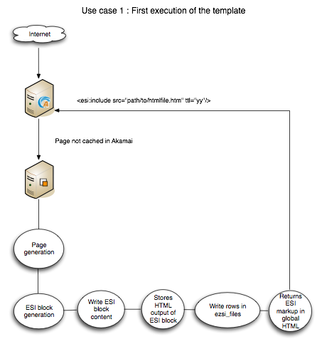
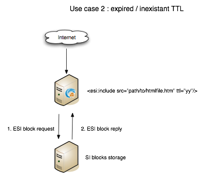
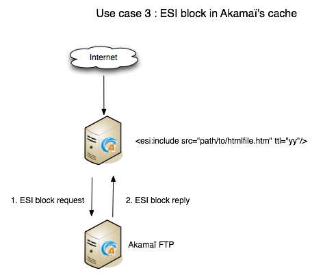
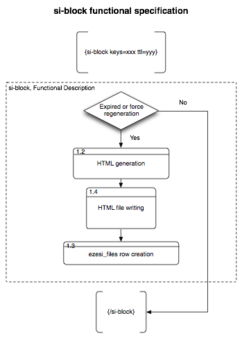
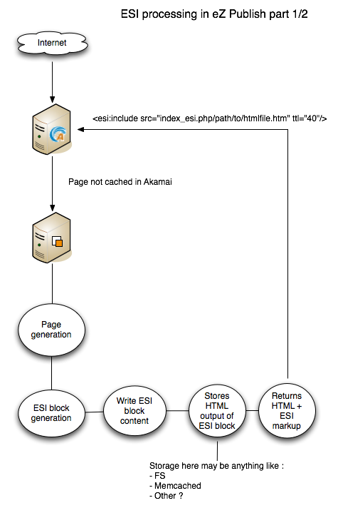
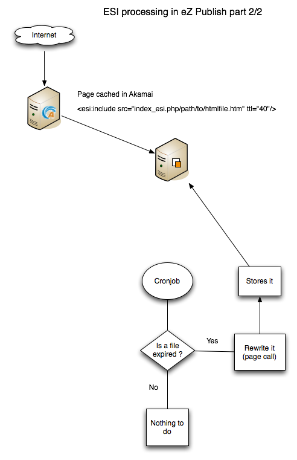
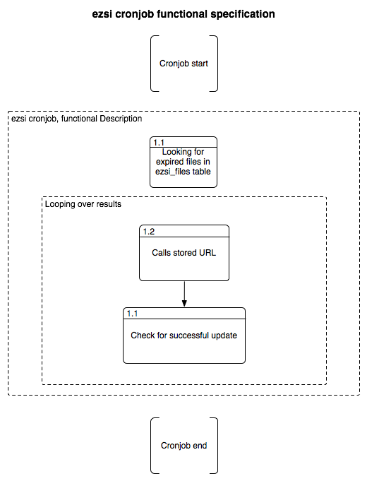

====================================
Documentation for the eZSI extension
====================================

.. -*- coding: utf-8 -*-
.. contents:: Table of Contents

Author
------
Jérôme Renard <jr@ez.no>

Introduction
------------
eZ Publish needed an extension that could be able to generate
ESI or SSI tags in order to let webservers / reverse proxies cache the HTML page
as efficiently as possible.
This is what the eZSI extension has been designed for.

What is eZSI ?
--------------
eZSI makes it possible to generate either ESI or SSI tags in
the HTML page generated by eZ Publish.

How does this extension work ?
------------------------------

I hope the images below will be clear enough to describe how this extension work :

Use case 1
==========

Use case 2
==========

Use case 3
==========

si-block functional specification
==================================

ESI processing part 1
=====================

ESI processing part 2
=====================

Cronjob workflow
================

Installation
------------

Extracting the extension
========================
Save the extension in your eZ Publish "extension" folder and extract it
with your favorite extracting tool. You can also run the
following command

::

    tar zxvf ezsi.tar.gz

this will create a folder called "ezsi" under the "extension" folder

Creating the new table
======================
You have to create a new database table before using ezsi.
In case you are using mysql, you can use the following command

::

    mysql -u <user> -p<password> <ezpublishdatabase> < path/to/ezpublish/extension/ezsi/sql/mysql/schema.sql

This table must be created in the same database as eZ Publish.

Activating the extension
=======================
In order to have the extension working you have add the following
line

::

    ActiveExtensions[]=ezsi

in

::

    settings/override/site.ini.append.php

And update the autoload array

::

    php bin/php/ezpgenerateautoloads.php -e

Or you can activate the extension by using the interface in the "admin" section
of the eZ Publish backoffice interface.

Setting up the cronjob
======================
In order to update SI blocks, ezsi is shipped with a cronjob which
'calls' all pages which contain SI blocks. It is up to you do decide
which frequency to use to launch the cronjob. The recommendation
is to take all your ttl and calculate the average; that will give you
enough informations to define a frequency. You can eg. add the
following line into your ezpublish.cron file since all the global
variables are already set:

::

    0,15,30,45 * * * * cd $EZPUBLISHROOT && $PHP runcronjobs.php -q siblockupdate 2>&1

Remember that this is just an example. In this case expired si-blocks will be
updated every 15 minutes. Defining very short TTL values will thus have not
the desired effect.

Removing the extension
----------------------
If you plan to remove this extension then is recommended to follow
the process described below

Removing all {si-blocks} calls
==============================
You will have to remove all {si-block} calls in your templates.
The following command will help you to find them

::

    grep -nR "{si-block" extension/ design/

If you are using SVN to version your files then you can use the following command
to avoid a lot of noise in the results of the above command

::

    grep -nR "{si-block" extension/ design/ | grep -v svn

Removing the cronjob
====================
You also have to remove the cronjob described above from
your crontab. Run ``crontab -e`` and remove the according line.

Removing the table
==================
You can now remove the ezsi_files table. To do this simply
run the following SQL query

::

    DROP TABLE ezsi_file

Deleting si-blocks
==================
If the si-blocks have been stored on the local file system then
they are stored in ``var/si-blocks/*``. You can simply run the following
command to remove them

::

    rm -rf var/si-blocks/

If the SI blocks are stored in an external system, FTP for example
then the you simply have to remove the 'si-blocks' folder.

Deactivating the extension
=========================
Remove the following line

::

     ActiveExtensions[]=ezsi

in

::

     settings/override/site.ini.append.php

Deleting the extension
======================
You can now remove the 'ezsi' folder which is located
in the "extension" folder.

Configuring the extension
-------------------------
All the useful configuration directives are located in
the following file

::

    extension/ezsi/settings/ezsi.ini.append.php

TemplateFunctionSettings
========================
Possible configuration

- ForceRegenerationString=<string>
- ForceRegenerationValue=<string>

It is possible to force the regeneration of a block by passing
<ForceRegenerationString>=<ForceRegenerationValue> in the URL.
http://www.site.com/path/to/page?<ForceRegenerationString>=<ForceRegenerationValue>
will force eZ Publish to regenerate the SI blocks defined in this page.

For example with the following configuration

::

    ForceRegenerationString=force_siblocks_update
    ForceRegenerationValue=yes

Will for the ezsi extension to update it SI blocks for
any page called with the following URL
http://wwww.site.com/url/alias?force_siblocks_update=yes

SIBlockSettings
===============
Possible configuration:

- BlockHandler=ESI
- BlockHandler=SSI
- BlockFilePathPrependString=<string>

If you choose

::

    BlockHandler=ESI

Then you should be able to use Akamaï or Varnish or whatever HTTP proxy
which recognizes ESI markup. You will see the following markup
in your templates

::

    <esi:include src="si-blocks/xxxxxxx.htm" ttl="yy"/>

If you choose

::

    BlockHandler=SSI

Then you should be able to use Apache's mod_include.
Before using SSIs make sure your Apache server is ready to accept
SSI calls. Please refer to the following documentation before using them:
http://httpd.apache.org/docs/2.0/mod/mod_include.html
You will see the following markup in your templates

::

     <!--#include virtual="si-blocks/xxxxxx.htm" -->

Defining a value to BlockFilePathPrependString is useful when SI blocks
and HTTP are not on the same server. The extension will automatically
generate the string 'si-blocks/<cachefilename>.htm' but this is not
sufficient for remote file systems.
We need informations on how to acess the file.
This may be a hostname to access the file directly
like http://siblocks.mysite.com/si-blocks/<cachefilename>.htm
If you plan to use a local storage then this directive
*MUST* be empty.

SIFilesSettings
===============
two options are possible here:

- FS ( local File System )
- FTP

If you choose

::

    FileHandler=FS

Then all SI blocks will be written on the local file system.
All the files will be stored in ``var/si-blocks/*``.

If you choose

::

    FileHandler=FTP

Then all SI bocks will be stored on a remote FTP. Its configuration
is described below. The blocks will be stored in ``si-blocks/*``.

FTPSettings
===========
These settings are only used for the FTP file handler.
If you choose

::

    FileHandler=FS

They will not be used.
The configuration directives are:

- Host=<string>
- Port=<integer>
- Login=<string>
- Password=<string>
- Timeout=<integer>
- DestinationFolder=<string>

DevelopmentSettings
===================
ActivateSIMarkup=enabled|disabled
When set to disable the extension will not insert
the SI tags in the HTML page. This makes it possible
to plan the use of SI blocks without breaking the HTML
of the page. Useful for development and debugging :)

Template function
-----------------

{si-block} function
===================
In order to have SI blocks generated in your HTML file you have
to call a new template function : si-block. The syntax is the following:

::

    {si-block key=string $key [tll=integer $ttl]}
         your template code here
    {/si-block}

The *key* attribute is mandatory and can be a scalar or an array.
You can use a hash if you want but no key will be taken into account.
You can not use objects as keys.

The *ttl* is optional. However is you plan to use ESI and
Akamaï it is recommended to use it. You can choose between
4 units :

- h (hours)
- m (minutes)
- s (seconds)
- d (days)

Specifying a floating point time is syntactically correct however
the extension will convert it into an int at runtime. This means
that for example setting ttl="9.5h" will not throw any syntax
error but the real TTL will be 9h.

You can put any template code between {si-block} instructions.
The template code inside these blocks will be interpreted and
stored into a static HTML file.

Key generation
==============
At a lower level the key for each block is composed by the
following informations :

- value of the "key" attribute
- location of the {si-block} call in the template
- template name
- siteaccess name
- urlalias
- view parameters

This means that you do not have to think about uniqueness
in your keys everything is already done in the template
function. Although it is not recommended, you can even use
the same key in the same template but at different locations
in this file - the final key will be different. This will make
the template more difficult to maintain though.

Important notes
---------------

{si-block} VS {cache-block}
===========================
SI blocks are not a replacement for cache-blocks since there is
neither subtree_expiry nor a complex key system.

Personalized pages
===================
It is not possible to usr SI blocks for personalized pages.
If you do this all user will see the same page.

Setting up Apache for SSI
-------------------------

This extension is able to generate SSI markup, however
Apache must be configure as described below. In order
to be able to use SSIs with eZ Publish, you need Apache 2.2.

Enabling mod_filter
===================
Apache needs a specific module to be able to parse SSI markup on the fly once the HTML
content is generated.This module is call mod_filter.
The documentation is available at this URL http://httpd.apache.org/docs/2.2/mod/mod_filter.html
This module is generally available with the default apache2 setup.
The only thing you have to do to enable it on Debian is to execute the following command

::

    a2enmod filter

Enablig mod_include
===================
This module makes it possible to parse SSI markup and is called
by mod_filter. Documentation for this module is available at this
URL : http://httpd.apache.org/docs/2.0/mod/mod_include.html
This module is generally available with the default apache2 setup.
The only thing you have to do to enable it on Debian is to execute the following command

::

    a2enmod include

Adding mod_filter rules
=======================
In your site's VirtualHost you can simply copy/paste the following
configuration directive

::

    FilterDeclare SSI
    FilterProvider SSI INCLUDES resp=Content-Type $text/html
    FilterChain SSI

Specific Rewrite Rule
======================
When using rewrite rules to secure your eZ Publish installation,
in order to be able to find and execute SSI calls you must add
the following RewriteRules in you site's VirtualHost. This directive
must be at the top of other directives

::

    Rewriterule ^/var/si-blocks/.* - [L]

Do not forget to reload the Apache configuration once you are done.

VirtualHost example
===================
Here is a complete example of a working VirtualHost that contains
all the needed mod_filter configuration directives.

::

    <VirtualHost *>

       ServerName site.com
       DocumentRoot /var/www/site.com

       <Directory /var/www/site.com>
           # The +Includes options is needed to accept SSI markup parsing
           Options Indexes FollowSymLinks +Includes
           AllowOverride None
       </Directory>

       DirectoryIndex index.php

       <IfModule mod_rewrite.c>
           RewriteEngine On
           Rewriterule ^/var/si-blocks/.* - [L]
           Rewriterule ^/var/storage/.* - [L]
           Rewriterule ^/var/[^/]+/storage/.* - [L]
           RewriteRule ^/var/cache/texttoimage/.* - [L]
           RewriteRule ^/var/[^/]+/cache/texttoimage/.* - [L]
           Rewriterule ^/design/[^/]+/(stylesheets|images|javascript)/.* - [L]
           Rewriterule ^/share/icons/.* - [L]
           Rewriterule ^/extension/[^/]+/design/[^/]+/(stylesheets|images|javascripts?)/.* - [L]
           Rewriterule ^/packages/styles/.+/(stylesheets|images|javascript)/[^/]+/.* - [L]
           RewriteRule ^/packages/styles/.+/thumbnail/.* - [L]
           RewriteRule ^/favicon\.ico - [L]
           RewriteRule ^/robots\.txt - [L]

           # Uncomment the following lines when using popup style debug.
           # RewriteRule ^/var/cache/debug\.html.* - [L]
           # RewriteRule ^/var/[^/]+/cache/debug\.html.* - [L]

           RewriteRule .* /index.php
       </IfModule>

        FilterDeclare SSI
        FilterProvider SSI INCLUDES resp=Content-Type $text/html
        FilterChain SSI
    </VirtualHost>